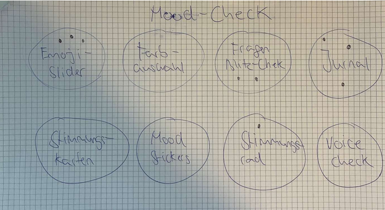
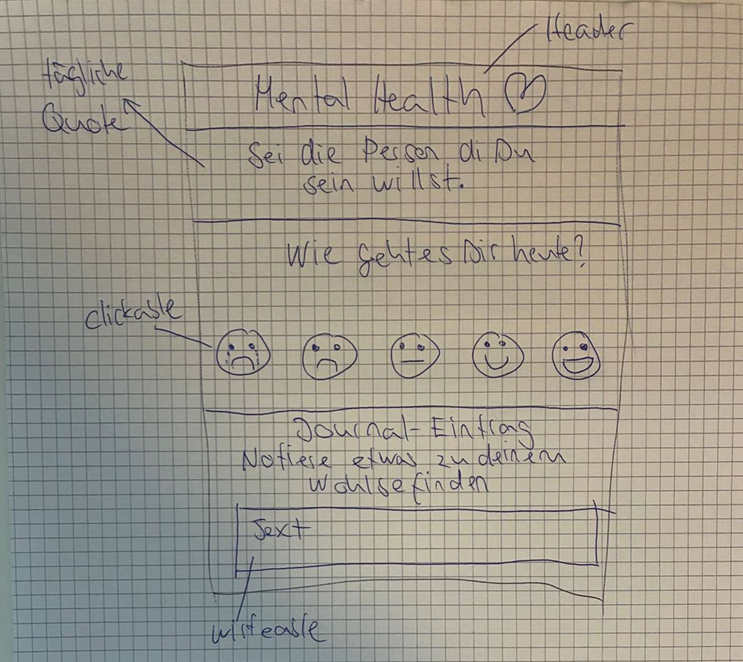
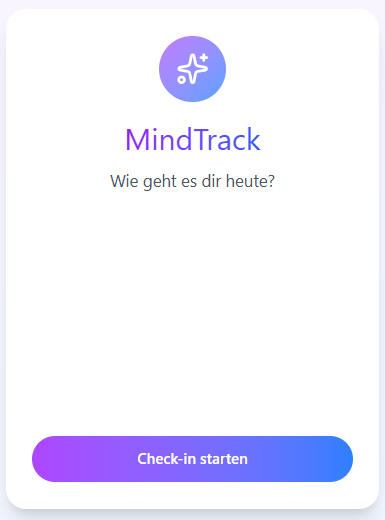
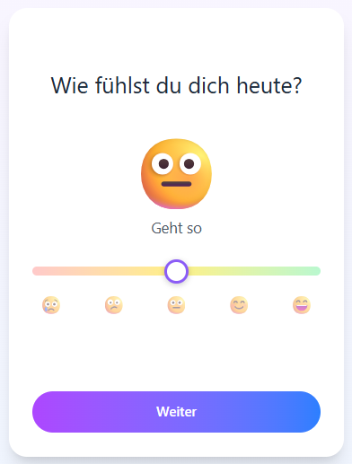
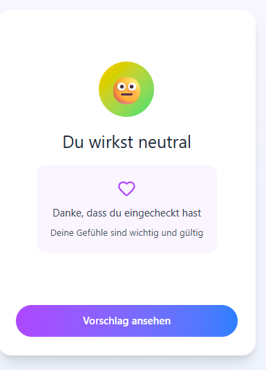
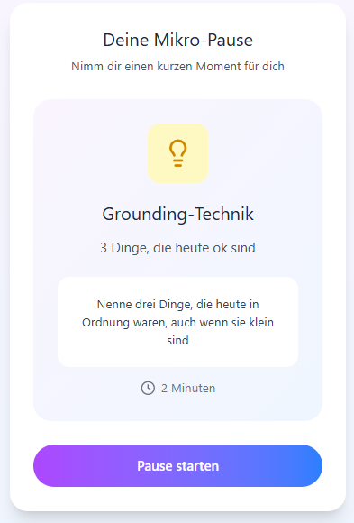
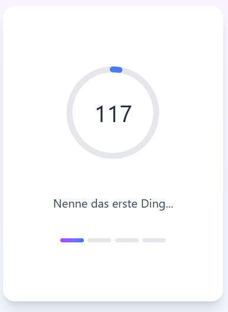
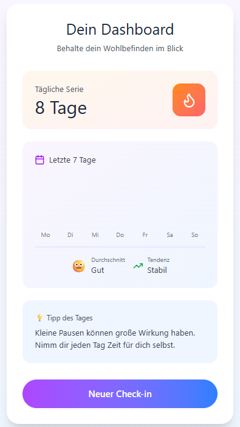

# Projektdokumentation – MentalHealth (Mood-Tracker)

## Inhaltsverzeichnis

1. [Einordnung & Zielsetzung](#1-einordnung--zielsetzung)
2. [Zielgruppe & Stakeholder](#2-zielgruppe--stakeholder)
3. [Anforderungen & Umfang](#3-anforderungen--umfang)
4. [Vorgehen & Artefakte](#4-vorgehen--artefakte)
    - [4.1 Understand & Define](#41-understand--define)
    - [4.2 Sketch](#42-sketch)
    - [4.3 Decide](#43-decide)
    - [4.4 Prototype](#44-prototype)
    - [4.5 Validate](#45-validate)
5. [Erweiterungen [Optional]](#5-erweiterungen-optional)
6. [Projektorganisation [Optional]](#6-projektorganisation-optional)
7. [KI‑Deklaration](#7-ki‑deklaration)

> **Hinweis:** Massgeblich sind die im **Unterricht** und auf **Moodle** kommunizierten Anforderungen.

---

## 1. Einordnung & Zielsetzung

### Kontext & Problem
Im Alltag ist es schwierig, die eigene mentale Gesundheit im Blick zu behalten. Stress und Überforderung ist für viele Menschen ein Problem. Eine intuitive Web-App soll Nutzende ermutigen, ihre Stimmung täglich zu reflektieren und dabei gleichzeitig kleine Achtsamkeitsübungen zu integrieren.

### Ziele
- **Schnell & einfach:** Mood-Check-In in max. 2 Minuten
- **Niedrigschwellig:** Emoji-basierte Bewertung (1–5) 
- **Reflektiv:** Optionale Notizen + integrierte Atemübung
- **Transparent:** Dashboard mit Überblick über eigene Stimmungseinträge und einfache Statistiken
- **Persistent:** Dauerhafte Speicherung in MongoDB Cloud-Datenbank

### Abgrenzung
Nicht im Umfang: Therapeutische Diagnosen

---

## 2. Zielgruppe & Stakeholder

### Primäre Zielgruppe
Personen, die ihre mentale Gesundheit regelmässig reflektieren möchten – von Studierenden über Arbeitstätige bis zu Interessierten an Achtsamkeit. Zielgruppe schätzt Simplizität und schnelle, tägliche Check-ins ohne Ablenkung.

**Weitere Stakeholder:**
Indirekt betroffen sind Lehrpersonen im Rahmen des Projekts (Feedback und Bewertung) sowie potenziell Fachpersonen aus dem Bereich Mental Health, die Interesse an einfachen, niedrigschwelligen Selbstreflexions-Tools haben.

**Annahmen:**
Nutzende bevorzugen eine sehr einfache, schnelle Erfassung ihrer Stimmung gegenüber komplexen Tagebuch- oder Tracking-Apps.

Kurze Achtsamkeitsübungen (Micro-Breaks) werden akzeptiert, wenn sie optional, kurz und klar eingebettet sind.

Nutzende sind eher bereit, die App regelmässig zu nutzen, wenn der Check-in in unter zwei Minuten abgeschlossen werden kann.

---

## 3. Anforderungen & Umfang

### Kernfunktionalität (Mindestumfang)

**Hauptworkflows:**

1. **Check-In-Workflow**
   - Stimmung wählen (Emoji-Skala 1–5)
   - Notiz (optional) hinzufügen
   - Kurze Atemübung anzeigen
   - Eintrag speichern

2. **Dashboard-Workflow**
   - Liste aller bisherigen Einträge mit Datum & Uhrzeit, gewählter Stimmung (Emoji) und gemachter Notiz zur Übung anzeigen
   - Einfache Statistik (täglicher Streak)
   - Nach Wunsch neues Check-in starten
   

### Akzeptanzkriterien
- Nutzende können einen Mood-Check-In von Start (Welcome) bis zur erfolgreichen Speicherung durchführen ohne Fehlermeldung
- Daten werden persistent in MongoDB gespeichert und bleiben nach Neustart erhalten
- Optionale Atemübung wird während des Check-Ins angezeigt
- Intuitives Design 

### Erweiterungen
- Trend-Range-Umschaltung (7 Tage, Monat, Jahr, gesamter Zeitraum) mit adaptiver Aggregation
- Delete-by-ID API + UI-Bestätigung mit Dialog

---

## 4. Vorgehen & Artefakte

### 4.1 Understand & Define

#### Ausgangslage & Ziele
Problembeschreibung: Viele Menschen wollen ihre mentale Gesundheit tracken. Ziel ist eine Minimalistische, fokussierte Lösung für schnelles tägliches Stimmungs-Tracking mit integrierter Achtsamkeit.

#### Zielgruppenverständnis
- **Persona:** Arbeitsbusy, gestresste Studierenden/Fachkräfte
- **Schmerz:** Keine Zeit für lange, aufwändige Journale
- **Hoffnung:** 2-Minuten-Check-in, einfache Statistik, Ruhe durch Atemübung

#### Wesentliche Erkenntnisse
- Einfachheit über Funktionsvielfalt
- Emoji/visuell statt Text-eingabe für Schnelligkeit


---

### 4.2 Sketch

#### Variantenüberblick
Mehrere Designvarianten für den Mood-Check wurden konzipiert:

 

#### Skizzendifferenzen

In den Übungslektionen wurden verschiedene Designideen erstellt und mit den Mitstudenten besprochen. Mit dem Feedback und in der Diskussion wurde die Idee für das grundlegende Design der Hauptfunktionalität der App konzipiert.
Die Differenzen der Designideen sind 100% kosmetisch (z.B: wir die Stimmung mit einer Skala von 1-10 oder mit einem Emoji evaluiert).


---

### 4.3 Decide

#### Gewählte Variante & Begründung


*Im Unterricht mit Feedback konzipiert*

**Entscheidkriterien:**
1. Einfachheit der Interaktion
2. Visuelles Feedback (Emoji > Zahlen)
3. Psychologische Wirkung (Emojis kommunizieren universell)

#### End-to-End-Ablauf

```
Welcome Screen 
→ User klickt „Check-in starten" 
Mood Check-in Screen 
→ User wählt Mood-Level (1–5) 
→ Klick auf „weiter" 
Mood Result Screen 
→ zeigt personalisierte Rückmeldung 
→ Klick auf „Vorschlag ansehen" 
Micro-Break Screen 
→ Kurzinfo zur Pause 
→ Klick auf „starten" 
Exercise Screen 
→ Übung durchführen (z. B. Atemübung) 
→ Klick auf „Done" 
Dashboard 
→ Mood wird gespeichert  
→ Nutzer kann neuen Check-in starten

```

#### Referenz-Mockup

**Mockups:**


*Welcome Screen – Einstiegsseite mit Überblick und Call-to-Action*


*Mood Check-in – Emoji-basierte Stimmungsauswahl (1-5)*


*Mood Result – Bestätigung und personalisierte Rückmeldung*


*Micro-Break – Kurze Pause-Anleitung*


*Exercise – Atemübung mit visueller Anleitung*


*Dashboard – Übersicht aller Mood-Einträge mit Statistiken*

---

### 4.4 Prototype

- **Kernfunktionalität:**  
  Der Prototyp bildet einen durchgängigen, geführten Ablauf ab, der in wenigen Schritten einen Mood-Check-in ermöglicht und danach eine kurze Achtsamkeitssequenz anbietet. Die zentralen Workflows sind:
  - **Start/Welcomeflow:** Einstieg und Orientierung, Start des Check-ins.
  - **Check-in:** Stimmung erfassen (Skala 1–5) und optional eine Notiz hinzufügen.
  - **Micro-Break & Übung:** kurzer Zwischenstep zur Entschleunigung inkl. Übung (geführt, ohne komplexe Einstellungen).
  - **Dashboard:** Übersicht über alle gespeicherten Einträge inkl. Verlauf/Diagramm, Filterung nach Zeitraum (z. B. diese Woche / letzter Monat / letztes Jahr / gesamter Zeitraum) und Listenansicht der Einträge.

- **Deployment:**  
  

#### 4.4.1. Entwurf (Design)

> **Hinweis:** Hier wird der **Prototyp** beschrieben, nicht das **Mockup**.

- **Informationsarchitektur:**  
  Der Prototyp ist als linearer, geführter Flow gestaltet, damit Nutzende ohne Nachdenken durch den Prozess kommen:
  - **Start/Welcome** → **Check-in** → **Micro-Break** → **Übung** → **Dashboard**  
  Das Dashboard ist dabei der “Ort”, an den Nutzende nach Abschluss zurückkehren, um Einträge zu sehen und zu reflektieren. Zusätzlich ist das Dashboard direkt erreichbar, um frühere Einträge jederzeit anschauen zu können.

- **Oberflächenentwürfe:**  
  - **Start/Welcome:** kurze Erklärung, klare CTA zum Starten des Check-ins.  
  - **Check-in:** sehr reduzierte Eingabemaske (Mood-Auswahl + optionales Notizfeld), damit der Check-in in unter 2 Minuten machbar bleibt.  
  - **Micro-Break:** kurze, verständliche Einbettung als Übergang (Entschleunigung, Vorbereitung).  
  - **Übung:** geführter Ablauf ohne Ablenkungen; Fokus auf Durchführung statt Konfiguration.  
  - **Dashboard:** Kombination aus
    - **grafischem Verlauf** (für schnellen Überblick/Trend)
    - **Zeitraum-Filter** (diese Woche / letzter Monat / letztes Jahr / gesamter Zeitraum)
    - **Liste der Einträge** (für Details, Datum/Notiz)

- **Designentscheidungen:**  
  - **Niedrigschwelligkeit vor Funktionsfülle:** wenige Entscheidungen pro Screen, klare Buttons, keine komplexen Einstellungen.  
  - **Geführter Flow:** die Reihenfolge ist bewusst linear, damit Nutzende nicht “lost” sind und der Ablauf als Routine funktioniert.  
  - **Übersicht + Details im Dashboard:** Diagramm/Trend für den Überblick, Liste für konkrete Einträge.  
  - **Mobile-freundlich:** Layout ist so gestaltet, dass es auch auf kleinen Screens gut bedienbar bleibt (große Touch-Ziele, klare Hierarchie).

#### 4.4.2. Umsetzung (Technik)

- **Technologie-Stack:**  
  - **SvelteKit** (Frontend + Server Routes/API)  
  - **JavaScript / HTML / CSS**  
  - **MongoDB (Atlas)** als persistente Datenspeicherung  
  - **Netlify** für Deployment

- **Tooling:**  
  - **Visual Studio Code**  
  - Lokale Entwicklung via `npm run dev`  
  - Deployment auf Netlify (Build/Deploy über Repository)  
  *(KI-Einsatz wird im Kapitel KI-Deklaration beschrieben.)*

- **Struktur & Komponenten:**  
  - **Routen/Screens:** Start/Welcome, Check-in, Micro-Break, Übung, Dashboard (und ggf. Result/Bestätigungsansicht)  
  - **State/Flow-Handling:** Zwischenstände (Mood/Notiz) werden während des geführten Flows im Client gehalten und am Ende serverseitig gespeichert.  
  - **Backend/Server:** SvelteKit Endpoint `/api/moods` für CRUD-Operationen  
  - **DB-Layer:** MongoDB-Zugriff ist in einer separaten Datei gekapselt (z. B. `src/lib/mongo.js`) mit wiederverwendbaren Funktionen (Insert/Read/Delete, einfache Stats).

- **Daten & Schnittstellen:**  
  **Endpoint `/api/moods`:**
  - `GET /api/moods?range=...` bzw. `GET` mit Limit/Filterung für das Dashboard (Einträge laden)  
  - `POST /api/moods` (neuen Mood-Eintrag speichern)  
  - `DELETE /api/moods` (Einträge löschen – z. B. für Reset/Testing) sowie ggf. Löschung einzelner Einträge

  **Datenmodell (Mood-Eintrag):**
  - `level` (1–5)  
  - `note` (optional)  
  - `createdAt` (Timestamp)

  **Environment Variable:**
  - `MONGODB_URI` (in `.env` lokal bzw. als Netlify Environment Variable)

- **Besondere Entscheidungen:**  
  - **Keine Authentifizierung:** Der Prototyp ist bewusst ohne Login umgesetzt, um den Fokus auf den Kernworkflow und die Evaluation zu legen.  
  - **Speichern am Ende des Flows:** Einträge werden erst nach Abschluss (Übung/Done) gespeichert, damit der Check-in als zusammenhängende Routine erlebt wird.  
  - **Einfache Visualisierung statt externer Chart-Library:** Das Diagramm ist bewusst leichtgewichtig umgesetzt, um Dependencies gering zu halten und die Performance stabil zu lassen.  
  - **Trade-off “Schnell & simpel” vs. “maximale Analyse”:** Statt komplexer Auswertungen liegt der Fokus auf einem verständlichen Verlauf + Zeitraumfilter, was für den Use-Case (tägliche Reflexion) genügt.
- **Testdaten für Entwicklung und Überprüfung:**  
    Um die Funktionalität der Diagramme sowie der Zeitraum-Filter (z. B. diese Woche, letzter Monat, letztes Jahr, gesamter Zeitraum) realistisch testen zu können, wurden während der Entwicklung gezielt Testdaten mit unterschiedlichen Zeitstempeln erzeugt. Diese Testdaten dienten ausschliesslich der Überprüfung der Aggregations- und Darstellungslogik und sind nicht Bestandteil des finalen Prototyps.
---

### 4.5 Validate

 „Getestet mit früherer Iteration“

- **URL der getesteten Version**  
 

  „Getestet mit früherer Iteration“

- **Ziele der Prüfung:**  
  Ziel der Usability Evaluation war es zu überprüfen,
  - ob der grundlegende End-to-End-Workflow des Prototyps funktioniert,
  - ob Nutzende den Ablauf **Start → Check-in → Micro-Break mit Übung → Notiz → Darstellung im Dashboard** selbstständig und ohne Hilfestellung durchlaufen können,
  - und welche zusätzlichen Bedürfnisse im Umgang mit den gespeicherten Einträgen entstehen.  
  Der Fokus lag bewusst zuerst auf der Funktionalität und Verständlichkeit des Kernablaufs. Darauf aufbauend sollte ermittelt werden, welche Erweiterungen sinnvoll sind.

- **Vorgehen:**  
  Moderierte Usability-Tests vor Ort.  
  Die Tests wurden am Laptop des Projektverfassers durchgeführt. Die Testpersonen bedienten den Prototyp selbstständig und wurden gebeten, laut zu denken. Es wurde nicht eingegriffen, ausser bei Verständnisfragen. Nach Abschluss der Aufgaben fand ein kurzes Abschlussgespräch statt.

- **Stichprobe:**  
  Zwei Mitstudierende, beide männlich.  

- **Aufgaben/Szenarien:**  
  **Aufgabe 1 – Check-in durchführen:**  
  Ausgangslage: Du hattest einen anstrengenden Tag und möchtest kurz innehalten.  
  Aufgabe: Du möchtest deine aktuelle Stimmung festhalten, eine kurze Übung durchführen und den Prozess abschliessen.  

  **Aufgabe 2 – Eintrag wiederfinden:**  
  Ausgangslage: Du hast den Check-in abgeschlossen.  
  Aufgabe: Du möchtest deinen Eintrag im Dashboard wiederfinden.  

  **Aufgabe 3 – Entwicklung einschätzen:**  
  Ausgangslage: Du hast die App bereits mehrmals genutzt.  
  Aufgabe: Du möchtest verstehen, wie sich deine Stimmung über mehrere Tage hinweg entwickelt hat.

- **Kennzahlen & Beobachtungen:**  
  Der komplette Basis-Workflow konnte von beiden Testpersonen ohne Hilfestellung erfolgreich durchlaufen werden.  
  - Erfolgsquote: 2/2 Testpersonen schlossen alle Aufgaben erfolgreich ab.  
  - Zeitbedarf: Der vollständige Check-in dauerte jeweils unter 2 Minuten.  
  - Qualitative Beobachtungen:
    - Die Reihenfolge der Schritte wurde als logisch empfunden.
    - Die Micro-Break-Übung wurde als sinnvoll wahrgenommen.
    - Beide Testpersonen hatten Mühe, aus der reinen Listenansicht im Dashboard eine Entwicklung über Zeit zu erkennen.
    - Es bestand der Wunsch nach mehr Überblick und Vergleichbarkeit der Einträge.

- **Zusammenfassung der Resultate:**  
  Die Usability Evaluation zeigte, dass der grundlegende Ablauf stabil, verständlich und nutzbar ist. Gleichzeitig wurde deutlich, dass Nutzende nach mehreren Einträgen zusätzliche Unterstützung benötigen, um ihre Stimmung über einen längeren Zeitraum hinweg zu reflektieren.

- **Abgeleitete Verbesserungen:**  
  1. Visuelle Darstellung des Stimmungsverlaufs, um Trends schneller erfassen zu können.  
  2. Filterung der Einträge nach Zeitraum, um gezielt bestimmte Phasen betrachten zu können.  
  3. Kombination aus Listenansicht (Details) und grafischer Übersicht (Überblick).

- **Umgesetzte Anpassungen:**  
  Basierend auf den Erkenntnissen aus der Usability Evaluation wurden folgende Erweiterungen umgesetzt:
  - Persistentes Tracking aller Mood-Einträge.
  - Dashboard mit Diagramm zur Darstellung des Stimmungsverlaufs.
  - Filterung nach Zeitraum (diese Woche, letzter Monat, letztes Jahr, gesamter Zeitraum).
  - Kombination aus grafischer Übersicht und Listenansicht zur besseren Interpretation der Daten.

---

## 5. Erweiterungen 

Die folgenden Erweiterungen gehen über den geforderten Mindestumfang hinaus und wurden auf Basis der Usability Evaluation umgesetzt. Ziel war es, den Prototyp nicht nur funktional, sondern auch langfristig nutzbar und aussagekräftig zu gestalten.

- **Beschreibung & Nutzen:**  
  Nach erfolgreichem Test des grundlegenden Workflows (Check-in, Micro-Break, Übung, Notiz, Dashboard) zeigte das Feedback der Testpersonen, dass die reine Listenansicht der Einträge nicht ausreicht, um Veränderungen der Stimmung über einen längeren Zeitraum zu erkennen.  
  Um die Reflexion über Zeit zu unterstützen, wurden folgende Erweiterungen umgesetzt:
  - **Persistentes Tracking aller Mood-Einträge**, sodass frühere Check-ins dauerhaft verfügbar sind.
  - **Grafische Darstellung des Stimmungsverlaufs**, um Trends und Entwicklungen auf einen Blick sichtbar zu machen.
  - **Filterung der Einträge nach Zeitraum** (z. B. diese Woche, letzter Monat, letztes Jahr, gesamter Zeitraum), um gezielt bestimmte Phasen betrachten zu können.
  - **Kombination aus Diagramm und Listenansicht**, um sowohl Überblick als auch Detailinformationen bereitzustellen.

  Diese Erweiterungen erhöhen den Mehrwert des Prototyps deutlich und unterstützen das ursprüngliche Ziel der regelmässigen, reflektierten Selbstbeobachtung.

- **Umsetzung in Kürze:**  
  Die Erweiterungen wurden innerhalb des bestehenden Dashboards umgesetzt. Mood-Einträge werden serverseitig gespeichert und beim Laden des Dashboards aggregiert.  
  Für die Darstellung des Stimmungsverlaufs werden die Einträge nach Datum gruppiert und abhängig vom gewählten Zeitraum (z. B. Woche, Monat, Jahr) gefiltert. Die Visualisierung erfolgt leichtgewichtig ohne externe Chart-Library.  
  Die Filterung und Darstellung sind vollständig clientseitig steuerbar, wodurch ein direkter Vergleich unterschiedlicher Zeiträume möglich ist.

- **Abgrenzung zum Mindestumfang:**  
  Der **Mindestumfang** umfasst:
  - den geführten Check-in-Ablauf,
  - die Speicherung eines einzelnen Mood-Eintrags,
  - sowie die Darstellung der Einträge im Dashboard in Form einer Liste.

  Die **Erweiterungen** bestehen explizit in:
  - der zeitlichen Analyse der Einträge,
  - der visuellen Darstellung des Stimmungsverlaufs,
  - und der Filterung nach definierten Zeiträumen.

  Diese Funktionen sind nicht notwendig, um den Kernworkflow zu erfüllen, wurden jedoch bewusst ergänzt, um die Usability und den langfristigen Nutzen des Prototyps zu erhöhen.

---
## 6. Projektorganisation 

- **Repository & Struktur:**  
  Das Projekt wurde in einem Git-Repository verwaltet. Die Struktur folgt der Standardkonvention von SvelteKit mit einer klaren Trennung zwischen Routen, wiederverwendbaren Komponenten, serverseitigen Endpoints und Hilfsfunktionen. Dies erleichtert die Orientierung im Code sowie die Weiterentwicklung des Prototyps.

- **Issue-Management:**  
  Ein formales Issue-System wurde für dieses Projekt nicht verwendet. Anforderungen, Anpassungen und Verbesserungen wurden direkt aus der Aufgabenstellung sowie aus den Ergebnissen der Usability Evaluation abgeleitet und anschliessend umgesetzt.

- **Commit-Praxis:**  
  Die Entwicklung erfolgte iterativ. Der finale Stand des Prototyps wurde als konsolidierter Commit ins Repository übernommen, da der Fokus des Projekts auf Konzeption, Usability und prototypischer Umsetzung lag.

## 7. KI-Deklaration

### Eingesetzte KI-Werkzeuge
- **GitHub Copilot** (VS Code Extension)  
- **ChatGPT** (Text- und Konzeptunterstützung)

### Zweck & Umfang
KI-Werkzeuge wurden unterstützend während der Entwicklung eingesetzt, insbesondere zur:
- Generierung von Codevorschlägen (z. B. SvelteKit-Patterns, API-Endpunkte, Datenverarbeitung),
- Unterstützung bei der Analyse und Behebung von Fehlern während der lokalen Entwicklung sowie bei der Datenbankanbindung,
- Unterstützung bei Refactoring und Code-Cleanup (z. B. Entfernen von Debug-Code, Vereinheitlichung der Struktur),
- Formulierung und Strukturierung von Abschnitten der Projektdokumentation (README),
- Erstellung von Testdaten für Entwicklungszwecke, um Funktionen wie Diagramme und Zeitraum-Filter realistisch überprüfen zu können.

Der Einsatz erfolgte bewusst punktuell und kontrolliert. KI-Vorschläge wurden nicht ungeprüft übernommen, sondern jeweils auf Verständlichkeit, Funktionalität und Passung zum Projektkontext überprüft und wenn nötig angepasst.

### Art der Beiträge
- **Teilweise KI-unterstützt:**  
  Für einzelne funktionale Teile des Prototyps wurden KI-generierte Codevorschläge als Ausgangspunkt genutzt. Dies betrifft insbesondere:
  - die Umsetzung der Diagramme zur Darstellung des Stimmungsverlaufs im Dashboard,
  - die Filterung der Mood-Einträge nach Zeiträumen (z. B. Woche, Monat, Jahr, gesamter Zeitraum),
  - die serverseitige Löschung einzelner Einträge anhand ihrer ID,
  - sowie unterstützende Vorschläge für die API-Logik und die Filter- und Aggregationslogik im Dashboard.

  Zusätzlich wurden KI-Tools zur Unterstützung bei Textentwürfen für Teile der Projektdokumentation sowie zur Generierung von Testdaten während der Entwicklungsphase eingesetzt.

### Eigene Leistung (Abgrenzung)
Die Konzeption des Prototyps, der Kernworkflow sowie die Auswahl und Priorisierung der Erweiterungen wurden eigenständig erarbeitet.  
KI-generierte Vorschläge unterstützten die Umsetzung, wurden jedoch kritisch geprüft, angepasst und bei Bedarf überarbeitet. Die finale Entscheidung über Struktur, Funktionalität und Darstellung lag bei mir.

### Reflexion
Der Einsatz von KI-Werkzeugen erwies sich als hilfreich zur Beschleunigung der Entwicklung und zur Inspiration bei technischen und textlichen Fragestellungen. Gleichzeitig zeigte sich, dass KI-Vorschläge ohne kritische Prüfung zu unnötigem Code, Debug-Artefakten oder inkonsistenten Lösungen führen können.  
Eine bewusste Qualitätssicherung (manuelle Tests, Code-Reviews sowie Usability-Tests mit Testpersonen) war daher notwendig, um die Qualität und Verständlichkeit des Prototyps sicherzustellen. KI wurde somit als unterstützendes Werkzeug eingesetzt und nicht als Ersatz für eigene Analyse, Entscheidungen und Verantwortung.